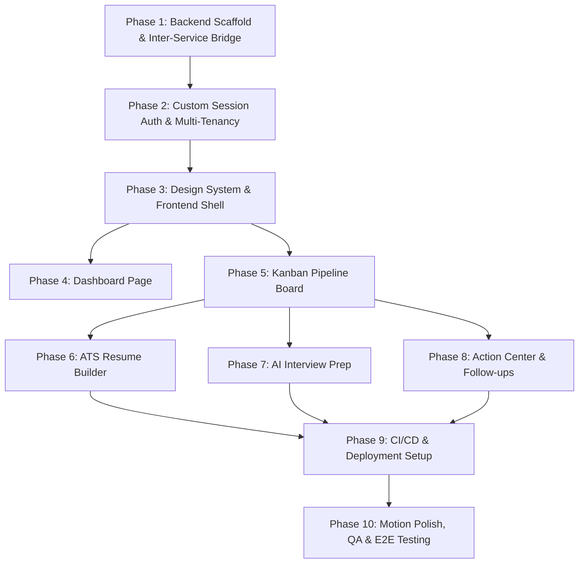

# JobTracker Project Roadmap (GSD Plan)

> **Based on**: [PRD_1.md](file:///Users/nikhildhankar/jobtracker/PRD_1.md)  
> **Status**: Ready for Phase 1 Discussion & Planning (`/gsd-discuss-phase 1` or `/gsd-plan-phase 1`)  
> **Core Architecture**: Vite + React SPA (Frontend) | Node.js + Express (Core CRUD & Auth) | Python + FastAPI (AI/NLP Service) | PostgreSQL (Relational) + MongoDB (Document)

---

## Milestone & Phase Breakdown

---

### Phase 1: Backend Scaffold & Inter-Service Communication
- **Goal**: Establish the Node.js/Express core server, PostgreSQL schema migrations, Python/FastAPI AI microservice, MongoDB connection, and verified internal service-to-service communication.
- **Deliverables**:
  - `server/`: Node/Express TypeScript server with routing, error handling, and Postgres/Mongo clients.
  - `ai_service/`: Python FastAPI service with healthcheck and internal authentication secret.
  - Database migrations for Postgres (`users`, `sessions`, `applications`, `stage_history`).
  - MongoDB models/schemas (`job_descriptions`, `resume_versions`, `interview_prep`, `followup_drafts`).
  - End-to-end integration test confirming Node backend can invoke Python FastAPI endpoints securely.
- **Verification**: `npm run test:services` passes; database health checks return 200 OK.

---

### Phase 2: Custom Session Auth & Multi-Tenant Enforcement
- **Goal**: Full custom session token authentication with httpOnly cookie storage, email verification flow, rate limiting, and strict multi-tenant isolation.
- **Deliverables**:
  - Cryptographic opaque session generation (`crypto.randomUUID()` / 32-byte hex) in PostgreSQL.
  - `httpOnly`, `Secure`, `SameSite=Strict` cookie handlers.
  - Password hashing with `bcrypt` / `argon2`.
  - Email verification token generation and verification link handler.
  - Authentication & tenant middleware attaching `req.user.id`.
  - Rate limiting on `/auth/login`, `/auth/signup`, `/auth/verify-email`.
  - Multi-tenant leak test suite verifying cross-user isolation.
- **Verification**: Automated auth integration tests passing (signup -> verify -> login -> protected route -> logout -> invalid session).

---

### Phase 3: Design System & Frontend Application Shell
- **Goal**: Implement the Clean Modern SaaS (Stripe/Craft style) design tokens, navigation shell (top navbar, collapsible sidebar with live badges), and global layout.
- **Deliverables**:
  - `src/styles/tokens.css`: Typography (`General Sans`, `Inter Tight`, `JetBrains Mono`), color tokens, multi-stop soft shadows, spring transitions.
  - Global Shell: Top persistent navbar with search trigger (`Cmd+K`), `+ New Application` CTA, user menu.
  - Collapsible Sidebar with navigation links (Dashboard, Pipeline, ATS Builder, Interview Prep, Action Center) and live status count pills.
  - Shared UI Components: Tactile buttons, soft-spring cards, segmented tabs, slide-over drawer (`520px`), status badges with live dot indicators.
  - Global Keyboard Shortcuts: `Cmd/Ctrl+K` command palette, `N` quick-add, `B` view toggle, `Esc` dismiss.
- **Verification**: Responsive layout verification, keyboard shortcuts working, accessibility & contrast checks pass.

---

### Phase 4: Page 1 — Dashboard (Overview & Analytics)
- **Goal**: High-level visual dashboard giving immediate clarity into job hunt progress and daily priorities.
- **Deliverables**:
  - KPI Metrics Strip: Total active applications, applications this week, response rate %, avg. days-to-response with trend badges.
  - Pipeline Funnel Visualization: Visual stage distribution bar / conversion funnel.
  - "Needs Attention Today" urgent action widget (stale applications > 7 days, upcoming interviews in 48h).
  - Recent Activity Feed: Chronological stream of the last 10 stage transitions and logged interactions.
- **Verification**: Dashboard renders dynamic metrics correctly from backend API; empty states look clean.

---

### Phase 5: Page 2 — Pipeline (Kanban Board & Slide-Over Drawer)
- **Goal**: Interactive drag-and-drop Kanban board across 6 stages with slide-over detail drawer.
- **Deliverables**:
  - 6-column Kanban Board: Wishlist, Applied, Screening, Interviewing, Offer Received, Archived/Rejected.
  - Drag-and-drop powered by `@dnd-kit/core` with optimistic updates and sync to `stage_history` table in Postgres.
  - Job Card component: Company logo/monogram, role, applied date, days-in-stage (stale warning highlight), work model pill, salary badge.
  - 520px Slide-Over Drawer with 4 tabs:
    - *Overview*: Role details, compensation, contacts, external job links.
    - *Timeline*: Stage history and activity log.
    - *Interview Prep*: Quick notes & checklist.
    - *Documents*: Attached resume version and notes.
  - Quick-add modal (`N` shortcut) for adding new applications.
- **Verification**: Drag-and-drop persists stage transitions; drawer opens smoothly without layout shift.

---

### Phase 6: Page 3 — ATS Resume Builder (AI-Powered)
- **Goal**: Compare job descriptions against base resume JSON, analyze keyword gaps, suggest bullet rewrites, and generate ATS-friendly resumes.
- **Deliverables**:
  - Base Resume JSON Editor (Summary, Skills, Experience, Projects, Education).
  - Python FastAPI endpoints:
    - JD keyword extraction (Required vs Nice-to-have).
    - Match % score and missing keyword gap analysis.
    - AI bullet rewriting with side-by-side original vs suggested comparison.
  - Rules-based ATS format scorer (detects tables, invalid fonts, missing dates, column layouts).
  - Resume versioning and export (.docx / clean PDF) linked to pipeline jobs.
- **Verification**: Resume upload/edit works; AI keyword extractor accurately scores and rewrites bullets with explicit user approval.

---

### Phase 7: Page 4 — AI Interview Prep (Per-Job Coaching)
- **Goal**: Targeted interview preparation based on actual job descriptions and interview rounds.
- **Deliverables**:
  - Tech stack & responsibility detection from job description via Python AI service.
  - Question Generator:
    - 5–8 technical questions scoped to stack.
    - 3–5 behavioral STAR-format questions.
    - 2–3 company/role-fit questions.
  - User Answer Bank: Rich text editor per question to save drafts in MongoDB.
  - System Design / DSA interactive checklist for technical rounds.
- **Verification**: Questions generate accurately for sample JDs; user answers persist and reload per application.

---

### Phase 8: Page 5 — Action Center (Follow-ups & Outreach)
- **Goal**: Proactive follow-up nudge system with email verification and AI draft generation.
- **Deliverables**:
  - Stale application detection (queries applications in Applied/Screening with $\ge$ 7 days inactivity).
  - Recruiter contact discovery & pattern generator.
  - Email deliverability verification (MX checks, domain probes, confidence badge: 🟢 Verified / 🟡 Risky / 🔴 Unverified).
  - AI follow-up email composer with customized JD context and `mailto:` link generator.
  - Upcoming interview alert list (< 48 hours).
- **Verification**: Stale jobs detected accurately; follow-up drafts generated contextually; mailto links launch properly.

---

### Phase 9: CI/CD & Production Deployment
- **Goal**: Production-ready builds, automated GitHub Actions pipelines, and cloud deployment.
- **Deliverables**:
  - GitHub Actions CI workflow (linting, type-checking, backend unit & integration tests, frontend build).
  - Deployment configurations:
    - Frontend SPA -> Vercel / Netlify
    - Node Backend -> Render / Railway
    - Python AI Service -> Render / Railway
    - PostgreSQL -> Supabase / Neon / Railway
    - MongoDB -> MongoDB Atlas
  - Environment variable validation scripts.
- **Verification**: CI passes on clean pull request; production build compiles cleanly without warnings.

---

### Phase 10: Motion Polish, Playwright E2E & Mobile QA
- **Goal**: Final UX polish, Framer Motion transitions with `prefers-reduced-motion` support, Playwright test suite, and mobile responsiveness.
- **Deliverables**:
  - Motion orchestration with `motion/react` (staggered dashboard reveal, drawer spring entrance).
  - `MotionConfig reducedMotion="user"` wrapper.
  - Playwright E2E test suite covering full user journey (Signup -> Add Job -> Drag to Interview -> AI Prep -> Follow-up).
  - Mobile layout & touch interaction audit.
- **Verification**: 100% Playwright test pass rate; lighthouse performance & accessibility scores $\ge$ 95.
